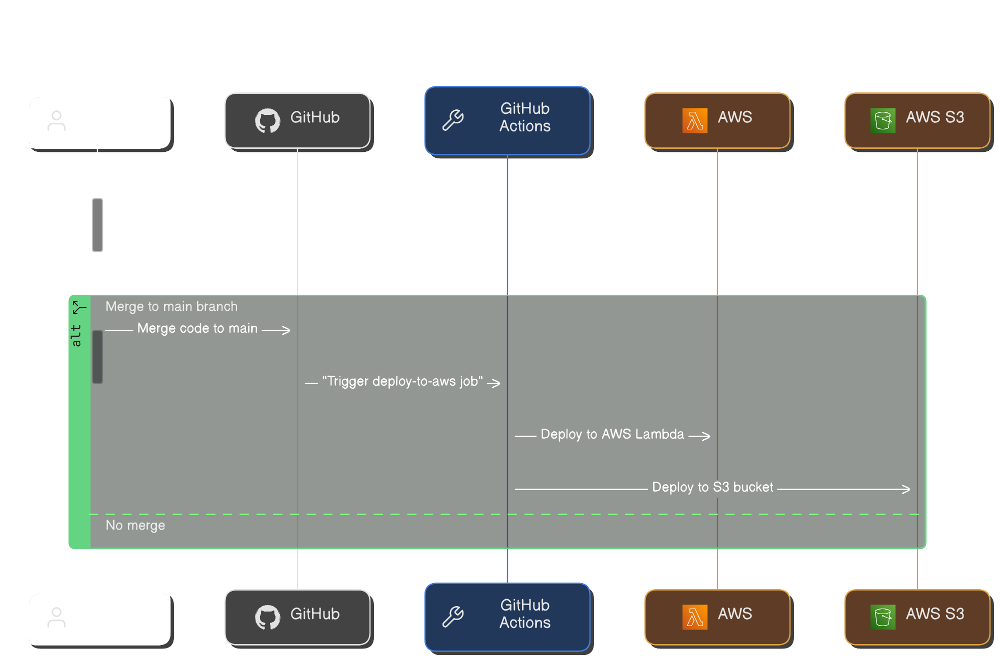

# Ping Pong 🏓
A Practical Guide to Writing and Deploying Lambda Functions from Your Local Development Environment to AWS

This repository contains the GitHub Actions configuration to build, test, and deploy Lambda functions written in Node.js to AWS.

## Tech Stack 📚 

| Category                  | Description                     |
|--------------------------|---------------------------------|
| Programming Language      | JavaScript                      |
| Execution Environment     | Node.js                         |
| Libraries Used            | Refer to `package.json`         |
| Testing                   | Jest                            |

## Configuration ⚙️
- There are two parts to this setup. The first part covers AWS configuration, and the second part focuses on setting up the GitHub repository and GitHub Actions.
- I wrote a blog post that details the steps to set up both parts. Give it a read, and feel free to ask questions if you get stuck. I'll respond to as many as possible.

## Project Architecture 🏙️

